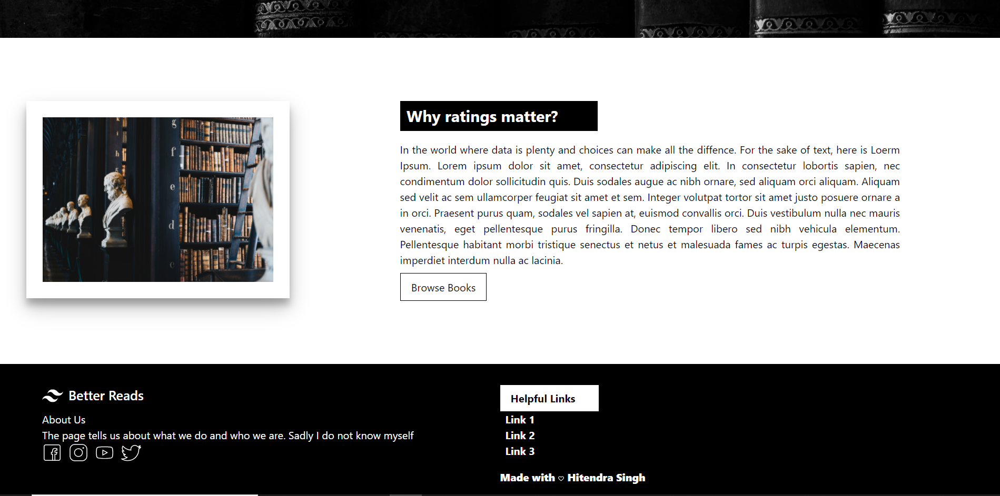
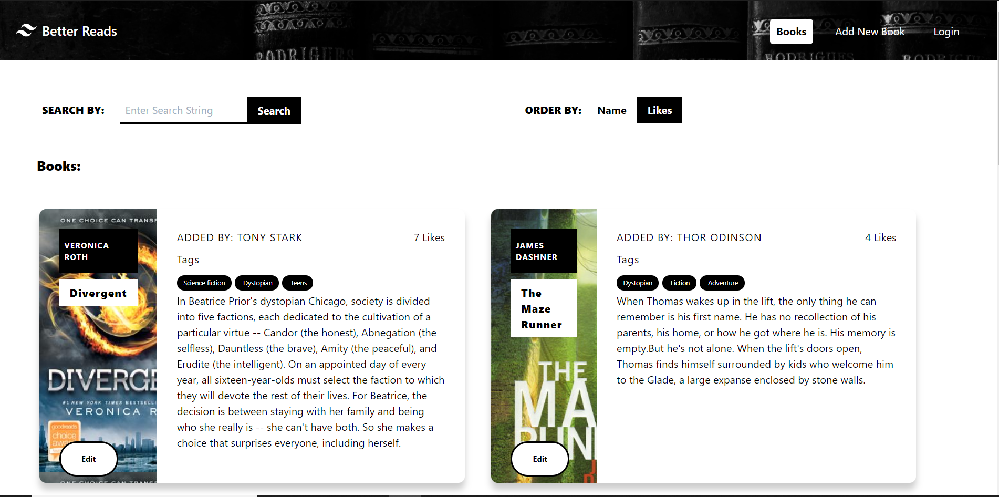
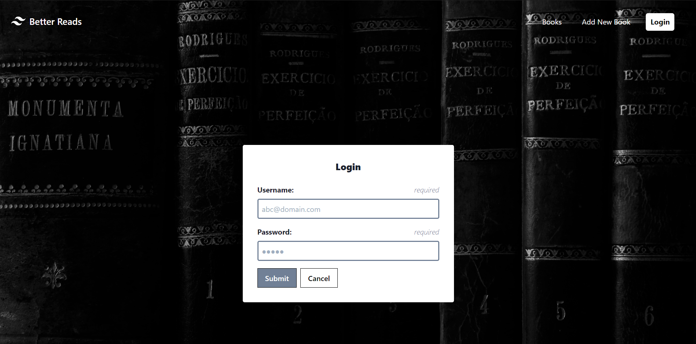
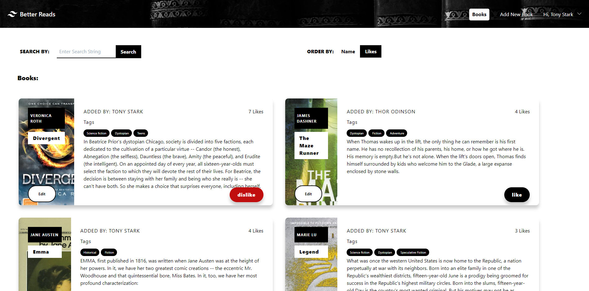
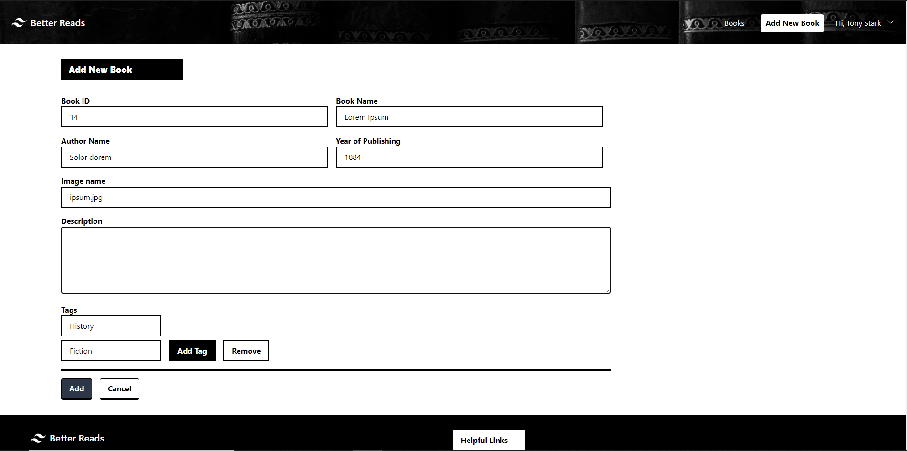
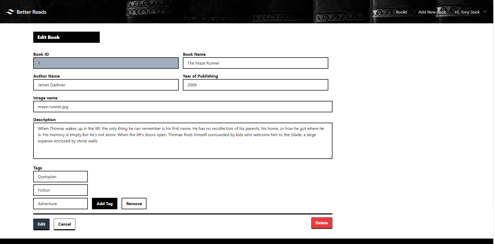

# BetterReads

This project was generated with [Angular CLI](https://github.com/angular/angular-cli) version 10.0.4. The Application is to add and like books whichever you like. The application runs on ngRx and json-server for CRUD operations.

## Steps to run
  ### Prerequisites
    1. Node version 12 .
    2. NPM version 6 or above.
    3. Angular CLI.
  ### Steps
    1. Download code repository.
    2. Run  'npm install'.
    3. After the step 2 is done open 2 command terminals inside the folder root.
    4. On terminal 1 run 'npm run start:server'.
    5. On terminal 2 run 'npm start'
    6. Open your browser and go to 'localhost:4200'
    
## Screenshots

1.Home Page

*Home Page*

*Home page*

2.Books Page

*Book page not logged in*

3.Log In page

*Login Page*

4.Book Page Logged In

*Book Home page logged In*

5.Add new book

*Add Book Page*

6.Edit Book

*Edit Book*

## Further help

To get more help on the Angular CLI use `ng help` or go check out the [Angular CLI README](https://github.com/angular/angular-cli/blob/master/README.md).
